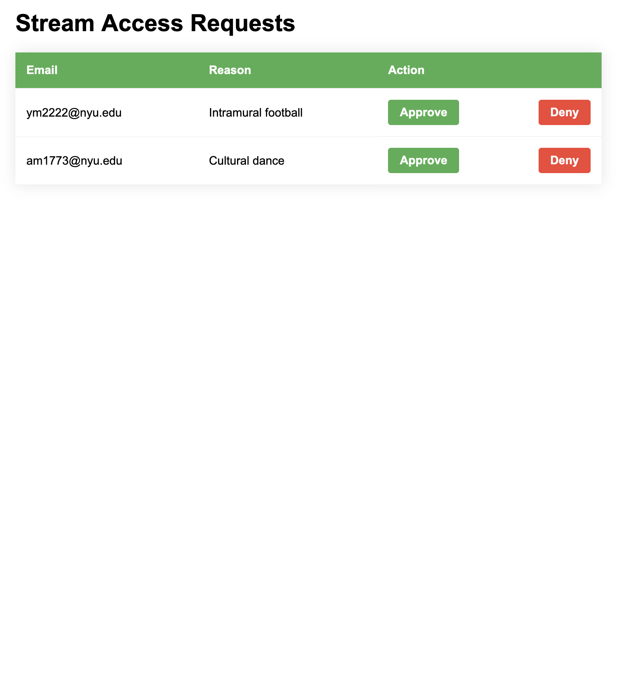
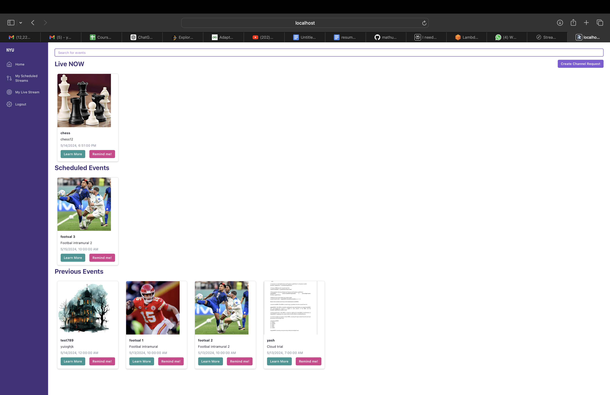
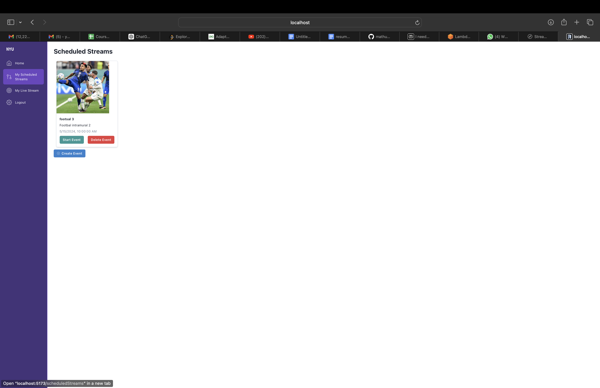
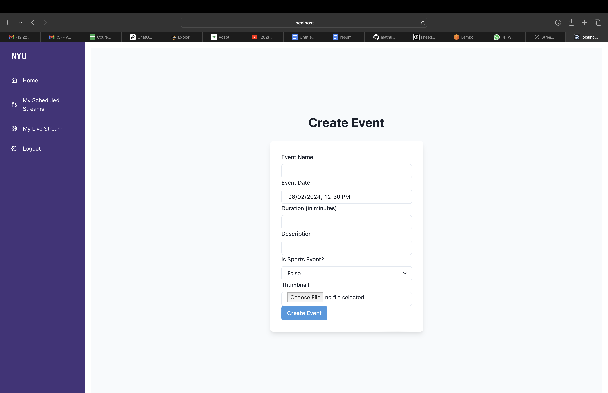
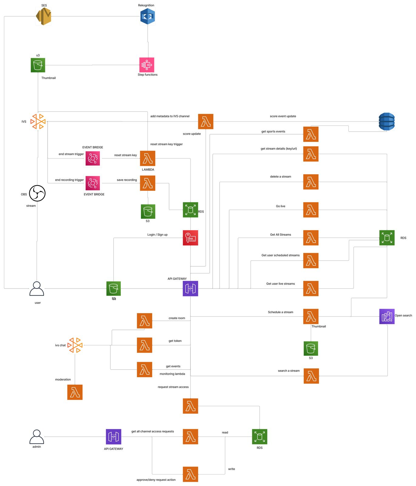

# Nyu-tv Cloud Project

## Contributors

This project was made possible by the contributions of the following individuals:

- Yash Mathur ([@mathur-14](https://github.com/mathur-14))
- Abhishek Mahajan ([@abhishekmahajan98](https://github.com/abhishekmahajan98))
- Madhuri Mahalingam ([@madhurimaha](https://github.com/madhurimaha))
- Yashaswi Makula ([@yashaswi2000](https://github.com/yashaswi2000))

**"Nyu-tv"** is a cloud-based project designed for individuals within Nyu to facilitate stream access requests, scheduling, and live streaming. Users can request stream access for their channels, allowing others from Nyu to subscribe and view streams with minimal latency. Leveraging AWS resources, the backend of this project is hosted serverlessly for efficient scalability and maintenance.

## Key Features:

- Stream access request system for Nyu individuals.
- Channel scheduling and live streaming capabilities.
- Low-latency viewing experience for Nyu subscribers.
- Utilizes AWS services for reliable and scalable backend infrastructure.
- Serverless architecture for efficient resource management and maintenance.

## General Flow:

- A new user signs in with their Nyu email ID (only Nyu students and staff can create accounts - AWS Cognito takes care of that).
- The new user can look at all the live events, scheduled events, and past recorded events.
- If the new user needs to create a channel, they'll first request the admin to give them permission to stream for the Nyu people by stating the channel name and reason.
- The admin receives a request and has the right to approve or deny the channel creation request.
   - If the admin denies, the new user won't be able to stream but will be able to watch other people's streams.
   - If the admin approves, the user will have the option to view streams, schedule their own stream, and go live.
- The dashboard will be common for all users:
    - Search bar: which will use AWS ElasticSearch and AWS Rekognition services to showcase the live, scheduled, and past streams related to the keyword searched.
    - Live streams: A list of all live streams that are being streamed now will be visible to the user. The user can click the one they want to watch and follow through. AWS IVS was implemented for the streamer as well as the watcher.
    - Scheduled streams: The user can view the details including the type of event, duration, and date of occurrence. A user can also click on "remind me," which will send the user an email once the scheduled stream goes live. A combination of Lambdas, SQS, and SES was used.
    - Past events: A user can watch the recorded past events which were stored in S3.
- For the users who have permission to create streams, they will have two other pages:
    - Scheduled events:
        - The user will have the option to schedule a stream for the future.
            - The user can schedule two types of events - a cultural/normal event or a sports event.
            - For a sports event, the streamer can update scores and show events as per the particular sport, which is displayed in real-time to the users watching the stream. This is carried out by taking advantage of the IVS metadata, which uses WebSockets in the background to support real-time updates.
            - The streamers can watch and also react by commenting in the chat section, which is also supported by AWS IVS.
            - We have also integrated the streaming service with Rekognition to prevent NSFW content, which would stop the streaming if found.
        - A list of scheduled events that can "go live" only after 15 minutes prior to the start date and time of the event. This will redirect the user to the "Your Live Stream" page.
    - Your live events:
        - The user can view the live event that they need to stream.
        - On clicking "go live," the user will have two options - stream via OBS or webcam.
        - The user will receive the stream key and ingest URL from the IVS to the web frontend, which the streamer will use in OBS to start streaming, similar to Twitch.
    - The user can also delete scheduled or live events if desired.

## Admin frontend

- Allows the admin to view all the requests from users to create a channel.
- Allows the admin to approve/deny an individual from creating a channel.
    - Calls AWS lambdas to fetch and update channel creation requests.

## NYU-TV frontend

- Allows the user to view live, scheduled and past streams.
- Additional functionality for the users to put reminders to future events and search events based on keywords.
- Implements AWS IVS for the streamers, where they get an additional functionality for the sport events to update scores and sport events in real time for the users to keep track of the event. To make it more interactive and engaging for the watchers, the watchers can share the reactions and comment in the global chat section. Comments are redacted if not appropriate.

Navigate to "My Scheduled Events"

Create a new event

## System Architecture

## Demo

### From the Streamer's POV

The video at [1] provides a demonstration from the streamer's perspective. It showcases the process of setting up a live stream using the Nyu-tv platform. The streamer can schedule an event, choose the event type (cultural/normal or sports), and specify details like the event name, description, and start time.

Once the scheduled event is within 15 minutes of the start time, the streamer can initiate the live stream. They have the option to stream either via OBS (Open Broadcaster Software) or through their webcam. For OBS streaming, the platform provides the necessary stream key and ingest URL, similar to platforms like Twitch.

The streamer can then start broadcasting their content, which is streamed live to viewers on the Nyu-tv platform. If it's a sports event, the streamer can update scores and event details in real-time, which are displayed to the viewers through the IVS metadata integration.

### From a Viewer's POV

The video at [2] demonstrates the viewer's experience on the Nyu-tv platform. Viewers can access a dashboard that displays various sections:

1. **Live Streams**: This section lists all the ongoing live streams. Viewers can click on a stream to start watching it.

2. **Scheduled Streams**: Viewers can see the details of upcoming scheduled streams, including the event type, duration, and date/time. They can also set reminders to receive notifications when a scheduled stream goes live.

3. **Past Events**: This section allows viewers to watch recorded streams from past events, which are stored in Amazon S3.

4. **Search**: The platform integrates with AWS ElasticSearch and AWS Rekognition services, enabling viewers to search for specific streams based on keywords. The search results display relevant live, scheduled, and past streams.

5. **Chat and Reactions**: While watching a live stream, viewers can engage with the streamer and other viewers through a chat section. They can also react to the stream using various emotes or reactions, enhancing the interactive experience.

The integration with AWS IVS (Amazon Interactive Video Service) ensures a low-latency viewing experience for the viewers, allowing them to seamlessly watch and engage with the live streams.

By providing these comprehensive features, the Nyu-tv platform offers a robust and engaging experience for both streamers and viewers within the Nyu community.

Citations: 
[1] https://www.youtube.com/watch?v=dfl9ZWO528c  
[2] https://www.youtube.com/watch?v=IKhF9NNj8IU